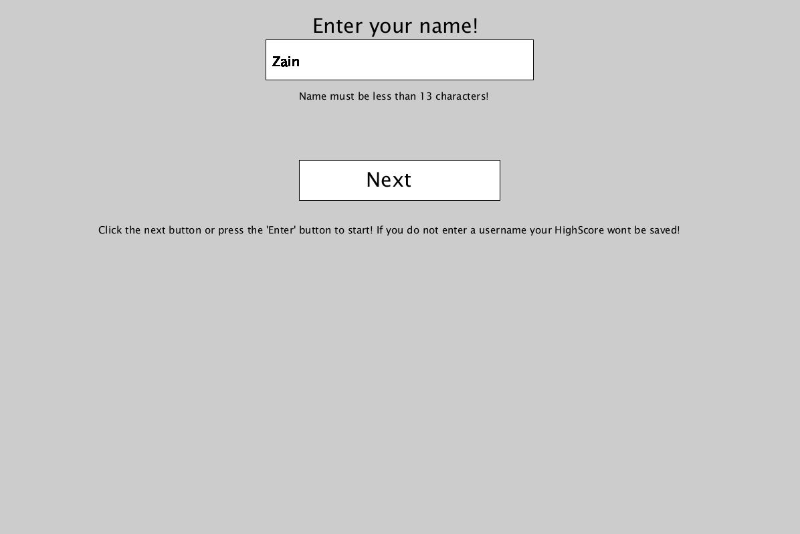

# Path-Finder
This is my MazeGame that uses a database. If you would like a video explanation of the project: https://www.youtube.com/watch?v=aEC3SoSilM4. This project uses multiple algorithims to both create and solve a randomely generated maze. Notably, It uses Dijkstra's algorithim to find the shortest path. It also allowes the user to try and solve the maze themseleves, giving them a score that depends on how accurate their path is when compared to the fastest path. It saves this score into a database. I used mySQL to save the scores. The code for the database itself is not found in this repsoitory due to security reasons. If you are interested in it, please email me at m.zainnajeeb@gmail.com. . To download this project, you first need to have Java 18.0.2 or above. To check what version of Java you have, open CMD and type in exactly "java -version". Here is the Java website to download the latest version of Java https://www.oracle.com/java/technologies/downloads/#jdk18-windows To download this project: 
1. Click on code
2. Download zip
3. Open the folder where you downloaded the zip (typically your downloads folder)
4. Right click on the zip
5. Click extract here
6. Open the folder 
7. Go to "out" --> "artifacts" --> "MazeFinder_jar" --> MazeFinder.jar(double click)
Some screenshots : 

